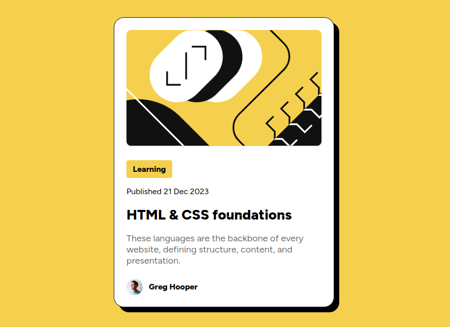

# Frontend Mentor - Blog preview card solution

This is a solution to the [Blog preview card challenge on Frontend Mentor](https://www.frontendmentor.io/challenges/blog-preview-card-ckPaj01IcS).

## Table of contents

- [Overview](#overview)
  - [The challenge](#the-challenge)
  - [Screenshot](#screenshot)
  - [Links](#links)
- [My process](#my-process)
  - [Built with](#built-with)
  - [What I learned](#what-i-learned)
- [Author](#author)

## Overview

### The challenge

Users should be able to:

- See hover and focus states for all interactive elements on the page

### Screenshot

### Links

- Solution URL: [Click Here](https://github.com/faizraeim/blog-preview-card)
- Live Site URL: [Click Here](https://faizraeim.github.io/blog-preview-card)

## My process

### Built with

- Semantic HTML5 markup
- CSS custom properties
- Flexbox

### What I learned
I learned how to use CSS custom properties to make the design more flexible and easier to maintain.
Centering a div and aligning image and text in a line inside it was a challenge. I used Flexbox to achieve this.

## Author

- Website - [Faizey.co](https://www.faizey.co)
- Frontend Mentor - [@faizraeim](https://www.frontendmentor.io/profile/faizraeim)
- LinkedIn - [@faizey](https://www.linkedin.com/in/faizey)
- Twitter - [@faizraeim](https://www.twitter.com/faizraeim)
